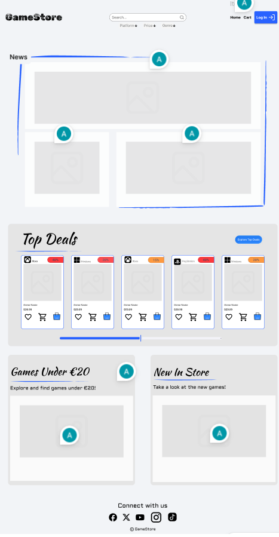
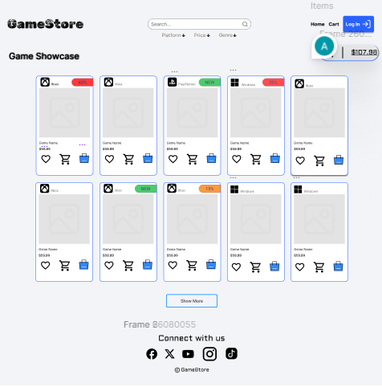
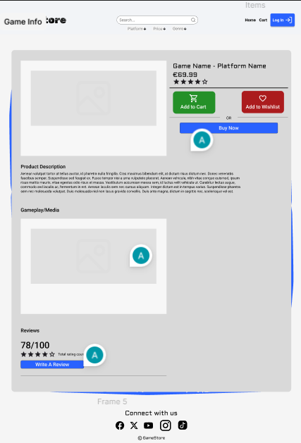

# GameStore E-Commerce Project

## Project Description
This is a full-stack e-commerce web application, built from scratch, that replicates the core functionality of a digital game store. The project includes a complete backend API, a relational database, and a component-based React frontend.

The goal is to build and deploy a real-world application, demonstrating skills in client-side and server-side development, database management, and professional Git workflows.

## Project Features
-   **Homepage:** A landing page featuring a "News" banner, a "Top Deals" horizontal scroller, and category links.
-   **Backend API:** A custom-built Node.js and Express API to handle all data and logic.
-   **Database:** A PostgreSQL database managed with Prisma to store game, user, and order information.
-   **Game Browse Page:** A page to browse, search, and filter all available games.
-   **Game Details Page:** A dynamic page for each game, showing its description, media, and purchase options.
-   **User Authentication:** Secure sign-up and log-in functionality.
-   **Shopping Cart & Wishlist:** Functionality for users to save and purchase games.

## Tools & Technologies

### Frontend
* **React:** A JavaScript library for building user interfaces.
* **TypeScript:** For static type-checking and safer code.
* **Vite:** A next-generation frontend tooling for a fast development experience.
* **React Router:** For client-side routing and page navigation.
* **CSS Modules:** For locally scoped, component-level styling.

### Backend
* **Node.js:** A JavaScript runtime for building the server.
* **Express.js:** A minimal framework for building our backend API.
* **Prisma:** A modern ORM for easy and safe database access.
* **PostgreSQL:** A powerful, open-source relational database.

### Deployment 
* **Vercel:** For hosting the frontend React application.
* **Render:** For hosting the backend API and the PostgreSQL database.

## Design
Here are the designs for the application, built in Figma.

### Homepage


### Games Showcase Page


### Game Details Page


## Installation & Setup

This project is a monorepo containing two separate projects: `client` and `server`. Both must be running at the same time.

```bash
git clone [https://github.com/alex-maletskyi/game-store.git](https://github.com/alex-maletskyi/game-store.git)
cd game-store

# Move into the server directory
cd server

# Install dependencies
npm install

# Set up your .env file
# (You'll need a .env file with a DATABASE_URL from a PostgreSQL provider)

# Run the database migrations
npx prisma migrate dev

# Seed the database with sample data
npx prisma db seed

# Start the server
npm run dev
# (Server will be running at http://localhost:5001)

# Open a NEW terminal. Leave the server running.
# Go back to the root and into the client directory
cd ../client

# Install dependencies
npm install

# Start the client
npm run dev
# (Client will be running at http://localhost:5173)